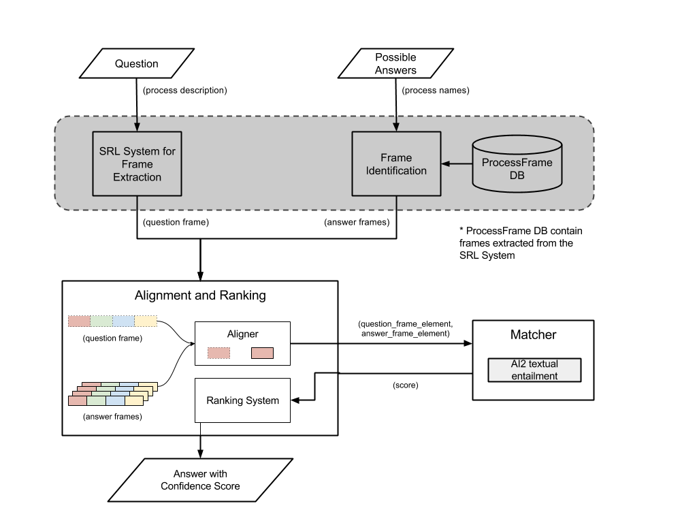
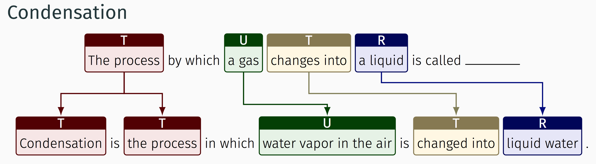

# Question Answering System

### Summary
The goal of this project is to build a question answering system that performs textual reasoning to answer and pass a 4th grade science exam.

#### System Architecture

##### Process Frame
We define process frame as a structure that captures complete information of a scientific process in a structured format. The frame element that we are using currently contains following frame elements.

- Undergoer
- Cause
- Manner
- Result

##### System Overview
The system takes descriptive question and four answer choices as input. This is then processed by subsystems shown in the following figure to produce an answer and an associated confidence score.

#### Example
The following image gives some intuition on how and why structural alignment helps question answering.

#### Code
The following modules are required to run the system:

  * Python 2.7
  * NumPy
  * Pandas
  * Scipy
  * scikit-learn
  * nltk
  * Matplotlib
  * Requests
  * JSON

and textual alignment service by [AI2](http://allenai.org) (Allen Institute for Artificial Intelligence).
